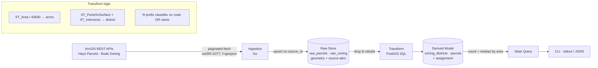

# Parcels & Zoning Data Product — Design Document

A pipeline that ingests Hays County parcels and City of Buda zoning, normalizes both, and answers: **residential parcels larger than one acre, with lot size computed from geometry, rolled up into count and median lot size by area.**

Time-boxed to 3–4 hours. This document states what I built, the calls I made, the calls I deliberately deferred, and the questions I'd take back to stakeholders.

---

## 1. Data reconnaissance (what's wrong with the inputs)

A few minutes sizing up the feeds surfaced the issues that actually shaped the design:

- **Two jurisdictions, mismatched coverage.** Zoning covers the *city* of Buda; parcels cover the *whole county*. The overwhelming majority of parcels have no zoning at all — so the spatial join must be built to *not match* as the common case, not the exception.
- **Projection / units quirk.** Area must be computed, not read. Correct area depends entirely on the coordinate system. Hays County sits in the **NAD83 Texas Central** state-plane zone (`EPSG:2277`), whose unit is **US survey feet** — so I normalize both feeds into 2277 and compute area in ft².
- **Serving format.** ArcGIS FeatureServers return Esri JSON (`rings`) by default, where holes and multipart polygons are implied by ring winding rather than structured. Requesting `f=geojson` sidesteps a class of ring-orientation bugs.
- **Unreliable stated areas + likely duplicates/nulls.** The brief warns the stated lot areas are stale; the ingestion assumes duplicate parcel IDs and null/blank zoning codes exist and handles both rather than trusting the source to be clean.
- **The parcels "link" is a Hub portal, not an endpoint.** Resolving the actual FeatureServer REST URL from the Hub page is a first-step task, not a given.

---

## 2. Architecture

A four-stage pipeline with a hard seam between *raw* and *derived* data, so a re-run — or a corrected source — never leaves a mess.



### System decomposition

| Component | Responsibility |
|---|---|
| **Ingestion (Go)** | Paginated, resumable fetch from both ArcGIS services. Normalizes CRS and format at the boundary. Owns retries and backoff. |
| **Raw Store (PostGIS)** | `raw_parcels`, `raw_zoning` — geometry plus *all* source attributes, keyed by source ID. The immutable landing zone; upsert-only. |
| **Transform (PostGIS SQL)** | Derives acres, classifies residential, assigns each parcel to a zoning district. Rebuilt from raw on every run. |
| **Stats / CLI (Go)** | Runs the grouping query and prints the result table (or JSON). No business logic lives here. |

**Why Go + PostGIS.** I explicitly chose *not* to reinvent computational geometry. Correct handling of projections, polygon holes, multipart geometries, and winding order is exactly what PostGIS exists for; hand-rolling shoelace and ray-casting is where subtle bugs live. Go keeps the ingestion concurrent and the tooling self-contained. The one cost is a Docker dependency — paid back by native `ST_Area`, `ST_PointOnSurface`, `ST_Intersects`, GiST indexing, and `percentile_cont` for median, plus a near-free path to the optional 1 km stretch.

---

## 3. Data model

Two datasets modeled as two entities, joined by an assignment — not flattened into one table, so the relationship between parcel and zoning stays explicit and re-derivable.

```sql
-- Landing zone: raw, keyed by source, geometry + everything the source gave us.
CREATE TABLE raw_parcels (
    source_id   TEXT PRIMARY KEY,          -- stable parcel identifier (PID/PROP_ID)
    attrs       JSONB,                     -- all source attributes, untouched
    geom        geometry(MultiPolygon, 2277)
);

CREATE TABLE raw_zoning (
    source_id   TEXT PRIMARY KEY,          -- zoning feature OBJECTID
    zone_code   TEXT,
    zone_name   TEXT,
    geom        geometry(MultiPolygon, 2277)
);

-- Derived model: rebuilt from raw on every run.
CREATE TABLE zoning_districts (
    id              TEXT PRIMARY KEY,
    zone_code       TEXT,
    zone_name       TEXT,
    is_residential  BOOLEAN,               -- computed: R-prefix on code OR name
    geom            geometry(MultiPolygon, 2277)
);
CREATE INDEX zoning_districts_gix ON zoning_districts USING GIST (geom);

CREATE TABLE parcels (
    id              TEXT PRIMARY KEY,
    computed_acres  REAL,                  -- ST_Area(geom)/43560, geometry-derived
    district_id     TEXT REFERENCES zoning_districts(id),   -- null = outside city
    geom            geometry(MultiPolygon, 2277)
);
CREATE INDEX parcels_gix ON parcels USING GIST (geom);
```

Keeping raw geometry and source attributes means the derived layer can be recomputed with corrected logic *without re-fetching* — the whole point of a re-runnable pipeline.

---

## 4. The core question

Because "residential" is defined on *zoning*, and zoning exists only inside Buda, the core question is implicitly scoped to city parcels — county parcels with no district simply fall out at the residential filter. That's a consequence of the rules as written, not a separate decision.

```sql
SELECT
    z.zone_code                             AS area,
    COUNT(*)                                AS parcel_count,
    percentile_cont(0.5) WITHIN GROUP (ORDER BY p.computed_acres) AS median_acres
FROM parcels p
JOIN zoning_districts z ON z.id = p.district_id
WHERE z.is_residential
  AND p.computed_acres > 1.0
GROUP BY z.zone_code
ORDER BY parcel_count DESC;
```

Key mechanics:
- **Area** — `ST_Area(geom) / 43560`. Geometry is in 2277 (feet), so the result is ft², and an acre is 43,560 ft² *by definition* in that unit system (survey-vs-international foot is immaterial here).
- **Spatial join** — each parcel is assigned via `ST_Intersects(district.geom, ST_PointOnSurface(parcel.geom))`. `PointOnSurface` guarantees a point *inside* the parcel, avoiding the L-shape / crescent misses a bounding-box or plain centroid would produce. GiST indexes keep this at O(log N), and non-city parcels are pruned by the index rather than brute-forced.
- **Median** — `percentile_cont(0.5)`, not average; computed in SQL, no application-side math.

---

## 5. Ingestion sturdiness

- **Pagination** — loop on `resultOffset` / `resultRecordCount` up to the service `maxRecordCount`, driven by `exceededTransferLimit`, with **`orderByFields` on a stable ID** so offset paging can't silently skip or duplicate rows.
- **CRS & format at the boundary** — `outSR=2277` and `f=geojson` requested on *both* feeds, so everything lands normalized regardless of each service's native storage SR. (The native SR is verified once against the layer's `?f=json` metadata; forcing `outSR` makes the pipeline robust even if it differs.)
- **Resilience** — retry with exponential backoff on 429/5xx; batch inserts inside a transaction.
- **Idempotency** — raw tables upsert with `INSERT … ON CONFLICT (source_id) DO UPDATE`; the derived layer is dropped and rebuilt from raw each run. Running twice, or against corrected data, converges to the same clean state.

---

## 6. Key decisions & deliberate deferrals

| Decision | Rationale (one line) |
|---|---|
| PostGIS over hand-rolled Go geometry | Don't reinvent GIS; buy correctness on holes/multipart/CRS for one Docker dep. |
| CLI over UI | A UI is the least-core thing in the brief; the budget goes to data integrity. |
| `PointOnSurface` for the join | Guaranteed-interior point; cheap accuracy win over centroid. |
| Normalize both feeds to 2277 at ingest | Single source of truth for units; area math becomes trivial and correct. |
| Group by zoning district (interim) | Directly joinable and defensible — but see the open question below. |

**Consciously deferred** (named, not hidden):
- **Majority-area overlap join** (`ST_Intersection` + area ratio) for parcels straddling a zoning boundary — more accurate, more complex; `PointOnSurface` is the defensible 4-hour call.
- **The UI** — deferred entirely.
- **The 1 km stretch** — deferred but *trivial* here: `ST_DWithin(geom, point, 3280.84)` (1 km in feet) or a `geography` cast, then `AVG`. The projected-feet choice is what makes it a few lines.
- **Geodesic area** — unnecessary inside a single state-plane zone.

---

## 7. Requirements — assumptions & questions

**Assumptions made:**
1. `EPSG:2277` is the correct area CRS for Hays County (Texas Central).
2. A stable, unique parcel ID exists in the parcels layer.
3. Zoning exposes separate code and name fields, and the R-prefix rule applies as literally specified.
4. `> 1 acre` is strict (`> 1.0`), and "median" means the 50th percentile.
5. Parcels outside city limits are out of scope for the *residential* question (no zoning → cannot satisfy the rule); they are still ingested.

**Questions I'd take back to stakeholders** (with why they matter):
1. **What does "by area" mean?** Grouping residential parcels by zoning district is mildly circular (the groups are, by construction, residential districts). Do you want stats by a named **subdivision/neighborhood** field, a **council district**, or a spatial grid (e.g., H3)? *Changes the whole aggregation axis.*
2. **R-prefix false positives.** The rule also matches `REC` (recreation) or `ROW` (right-of-way) if such codes exist. Do we want an explicit exclusion list, or is over-inclusion acceptable? *Directly moves the counts.*
3. **Straddling parcels.** When a parcel spans two districts, is representative-point assignment acceptable, or do you need majority-area (or split) attribution? *Affects boundary parcels and the definition of "belongs to."*
4. **Unzoned parcels.** Report them as an explicit "outside city / unzoned" bucket, or exclude silently? *Changes whether the output is city-only or county-wide.*
5. **Cadence.** One-shot analysis or recurring pipeline? *Determines how much idempotency and scheduling machinery is justified.*

---

## 8. Testing strategy (TDD)

- **Ingestion** — mock HTTP server returning multiple pages; assert all records assemble and a second run upserts rather than duplicates. Assert backoff triggers on injected 5xx.
- **Area** — insert a known 1-acre square (208.71 ft sides) and assert `ST_Area/43560 ≈ 1.0`; a polygon *with a hole* and a *multipolygon* to confirm the library, not a hand-rolled loop, handles them.
- **Spatial join** — points clearly inside, clearly outside, and on an edge/vertex; an L-shaped parcel whose bbox-centroid would fall outside, confirming `PointOnSurface` still lands inside.
- **Classifier** — `R-1`, `RM`, `Residential — Single Family` (mixed case), leading/trailing whitespace (positives); `C-1`, blank, null (negatives). Verifies the code-*or*-name, case-insensitive, trimmed rule.

---

## 9. Process & AI usage

I used AI to accelerate boilerplate (ArcGIS query params, `docker-compose` for PostGIS, PostGIS function signatures) and to pressure-test the design — an early draft proposed a Wails desktop app and hand-rolled shoelace/ray-casting, which a review pass correctly flagged as scope creep and needless reinvention; that fed the pivot to a CLI + PostGIS.

Checks applied to AI output:
- **Verified, didn't trust, the CRS** — the "zoning is in 2277" claim gets confirmed against layer metadata, and `outSR=2277` is forced on both feeds so the pipeline is correct even if it isn't.
- **Validated area against a known-area polygon**, and cross-checked a handful of computed acres against the source's *stated* area as a sanity signal only — never as truth.
- **Spot-checked centroid/point-on-surface assignments** against the interactive zoning map for a few boundary parcels.

---

## Appendix — Execution steps

1. `docker-compose up` PostGIS; init Go module.
2. Ingestion: paginated client → `raw_*` upserts (tested against a mock server first).
3. Transform SQL: rebuild `zoning_districts` and `parcels`; area, classifier, join (tested against known geometries).
4. CLI: run the stats query, print table / JSON.
5. If budget remains: the 1 km `ST_DWithin` stretch.
